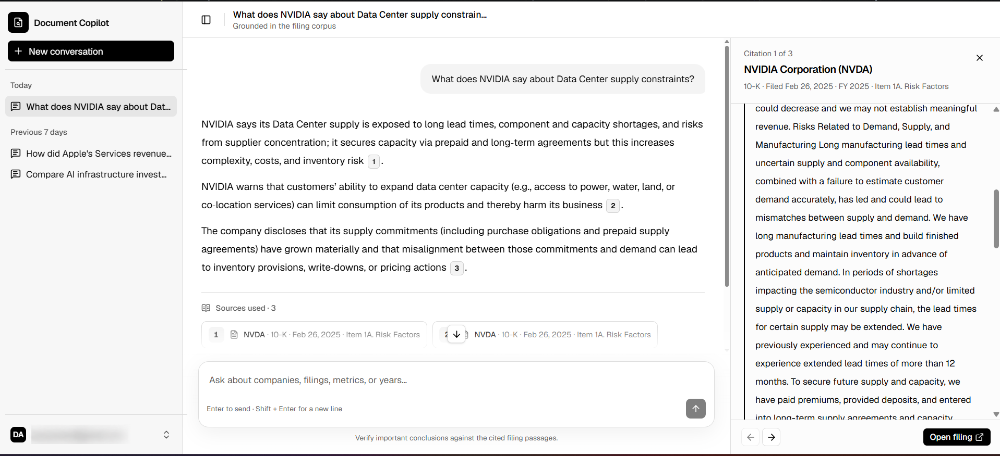
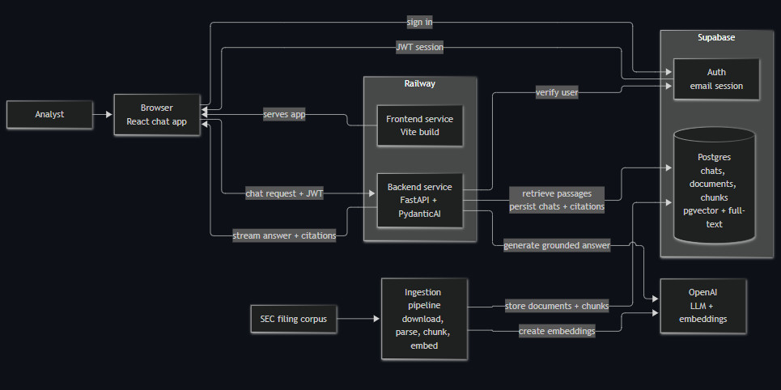
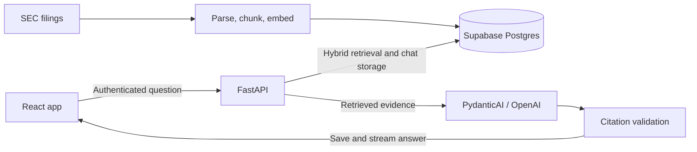

# Document Copilot

A deployed full-stack AI research assistant for querying SEC filings in plain English and inspecting the source passages behind its answers.

[Live demo](https://frontend-production-140e.up.railway.app/signin)

The corpus contains 25 annual 10-K filings across five companies and five fiscal
years, indexed as 8,170 chunks. Hybrid retrieval combines pgvector semantic
search with PostgreSQL full-text search using Reciprocal Rank Fusion. Answers
include clickable citations, and authenticated users can return to saved chats.

Built as a portfolio project around a fictional investment research brief.

## Screenshots

### Deployed application

Chat history, a cited answer, and the selected SEC filing passage in the live app.



### System architecture

The deployed services, authentication, retrieval, and corpus ingestion paths.



## Features

- **Hybrid search:** semantic and keyword retrieval combined with Reciprocal Rank Fusion.
- **Inspectable citations:** filing metadata and source passages available from the answer.
- **Grounding checks:** validates citation references and excerpts against retrieved evidence before releasing an answer.
- **Persistent conversations:** email/password authentication, saved threads, and user-scoped access.
- **Chat feedback:** progress updates during retrieval and generation, followed by streamed answer text after validation and persistence.
- **Repeatable ingestion and deployment:** filing conversion, chunking, embeddings, Alembic migrations, and separate Dockerized Railway services.

## How it works

SEC filings are downloaded, parsed, chunked, and embedded into Supabase
Postgres. For each authenticated question, FastAPI retrieves relevant passages,
combines the search rankings, and uses a PydanticAI agent with OpenAI to draft
an answer. The backend checks the citations, saves the conversation turn, and
streams the result to the React app.



See the [architecture](docs/architecture.md) for service boundaries and the
[fictional client brief](docs/client-brief.md) for the research use case.

## Stack

| Layer              | Choice                                               |
| ------------------ | ---------------------------------------------------- |
| Backend            | Python + FastAPI                                     |
| Frontend           | Vite + React SPA + TypeScript                        |
| Database           | Supabase Postgres (users, chats, documents, chunks)  |
| Migrations         | SQLAlchemy models + Alembic                          |
| Retrieval          | Supabase `pgvector` + Postgres full-text search      |
| Auth               | Supabase Auth (email only)                           |
| Hosting            | Railway                                              |
| LLM + embeddings   | OpenAI                                               |

## Repo layout

```text
document-copilot/
├── AGENTS.md           # agent instructions (read first)
├── README.md           # this file
├── data/               # local corpus + download script (payloads gitignored)
├── docs/
│   ├── architecture.md # service boundaries and data flow
│   ├── client-brief.md # the client one-pager
│   ├── guides/         # Supabase, backend, frontend, Railway setup
│   ├── images/         # README screenshots
│   └── phase-*.md      # implementation plans per phase
├── backend/            # FastAPI service, ingestion, evals, tests
└── frontend/           # React SPA (Vite)
```

## Prerequisites

Install these before setting up `backend/` or `frontend/`:

| Tool | Version | Used for | Install |
| ---- | ------- | -------- | ------- |
| [Python](https://www.python.org/downloads/) | 3.12+ | Backend runtime | OS package manager or python.org |
| [uv](https://docs.astral.sh/uv/getting-started/installation/) | latest | Backend deps + `data/download.py` | `curl -LsSf https://astral.sh/uv/install.sh \| sh` |
| [Node.js](https://nodejs.org/) | 24 (matches Docker build) | Frontend toolchain | nodejs.org |
| [pnpm](https://pnpm.io/installation) | latest | Frontend package manager | `corepack enable && corepack prepare pnpm@latest --activate` |

You also need a Supabase project and an OpenAI API key. Start with the
[Supabase setup guide](docs/guides/supabase-setup.md) and configure the service
environment files below.

## Running locally

Create the service environment files from the repository root:

```powershell
Copy-Item backend/.env.example backend/.env
Copy-Item frontend/.env.example frontend/.env
```

Fill in these values before starting either service:

| File | Required values |
| --- | --- |
| `backend/.env` | `SUPABASE_URL`, `SUPABASE_ANON_KEY`, `SUPABASE_SERVICE_ROLE_KEY`, `DATABASE_URL`, `OPENAI_API_KEY`, `OPENAI_CHAT_MODEL`, `OPENAI_EMBEDDING_MODEL`, `OPENAI_EMBEDDING_DIMENSIONS`, `ALLOWED_ORIGINS` |
| `frontend/.env` | `VITE_API_BASE_URL`, `VITE_SUPABASE_URL`, `VITE_SUPABASE_ANON_KEY` |

The timeout and history values in `backend/.env.example` are optional production
tuning settings with safe defaults.

In the first terminal, install the backend, apply migrations, and start FastAPI:

```powershell
Set-Location backend
uv sync --frozen
uv run alembic upgrade head
uv run uvicorn app.main:app --reload
```

In a second terminal, install and start the frontend:

```powershell
Set-Location frontend
pnpm install --frozen-lockfile
pnpm dev
```

Open <http://localhost:5173>. The API health check is
<http://127.0.0.1:8000/health> and API documentation is
<http://127.0.0.1:8000/docs>.

## Setup guides

Use the service guides for local development and the Railway guide for production:

- [Supabase](docs/guides/supabase-setup.md) — account, hosted project (dashboard or CLI)
- [Backend](docs/guides/backend-setup.md)
- [Frontend](docs/guides/frontend-setup.md)
- [Railway deployment](docs/guides/railway-deployment.md) — production services, variables, migrations, and smoke tests

## Sample SEC data

Use the standalone downloader to fetch a small local 10-K sample from SEC EDGAR.
Edit the params at the top of `data/download.py`, especially `USER_AGENT`, then run:

```bash
uv run data/download.py
```

By default this downloads the latest 5 10-K filings for AAPL, MSFT, NVDA, AMZN, and GOOGL into year folders under `data/downloads/` and writes a `manifest.json`.
Downloaded files are gitignored; the `data/` folder itself stays in git for the script and notes.

### Ingest or update the corpus

The complete workflow is idempotent by SEC accession number and chunk content.
Run download and conversion from the repository root:

```powershell
uv run data/download.py
uv run --project backend python data/convert_to_markdown.py
uv run --project backend python data/convert_to_docling.py
```

Then load source documents, preview chunking, test one paid embedding, upload the
complete corpus, and verify it:

```powershell
Set-Location backend
uv run python ingest/source_documents.py
uv run python ingest/pipeline.py
uv run python ingest/pipeline.py --accession <accession-number> --max-chunks 1 --upload
uv run python ingest/pipeline.py --upload --full
uv run python ingest/verify.py
```

Replace `<accession-number>` with one value from
`data/downloads/manifest.json`. Re-running the loaders updates changed filings,
skips current chunks, and removes stale trailing chunks after a complete
document upload. `data/download.py` clears its download directory by default;
change its scope parameters deliberately before refreshing a production corpus.

## Verification and demo scope

- Latest local verification: 86 backend tests passed (two integration tests
  excluded); frontend TypeScript, lint, and production build passed.
- The project owner manually verified deployed sign-in, answer streaming,
  citation passages, nested-route refresh, and chat history across sessions.
- Citation validation checks provenance and excerpt matching; it does not
  guarantee that every generated interpretation is correct.
- The fictional brief's analyst time-saving target has not been measured.
